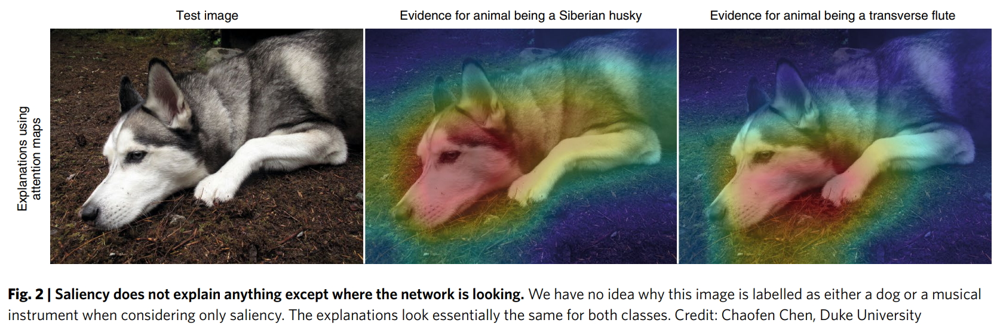

# Summary of "Stop Explaining Black Box Machine Learning Models for High Stakes Decisions and Use Interpretable Models Instead" by Cynthia Rudin

**The AI transparency trap: why we must stop "Explaining" black boxes in high-stakes decisions**  
Machine learning algorithms are increasingly being used to make decisions that forever alter human lives. They decide who gets bail and who goes to prison, who receives a loan, and how medical patients are diagnosed. But there is a massive problem: many of these algorithms are "black boxes." They are so complex or heavily guarded as corporate secrets that no human can truly understand how they arrive at their conclusions.

To solve this, a massive trend in the data science community has been to focus on "explainable AI": creating secondary models that try to guess and explain what the black box is doing.

In her groundbreaking 2019 paper in Nature Machine Intelligence and her lectures, professor Cynthia Rudin makes a bold, urgent plea: we need to stop trying to explain black box models for high-stakes decisions, and start using inherently interpretable models instead.

Here is a deeper look at the technical realities, the mathematical challenges, and the regulatory shifts required to fix our AI transparency problem.

### The chasm: "Explainable" vs "Interpretable"  
As Rudin notes, "interpretable and explainable... they sound the same they're completely different".

Explainable ML uses a black box model that humans cannot comprehend, and then uses a second, post-hoc model to approximate or "explain" its behavior.

Interpretable ML uses a model that is naturally transparent. Its very structure provides its own faithful explanation of exactly how it computes a prediction.

In explainable machine learning, you basically do some calculation that makes an excuse for why it's okay to use that black box. If an explanation model were 100% faithful to the black box, it would be the original model. Because explanations are only approximations, they are inherently wrong some of the time. If an explanation is only accurate 90% of the time, that means 10% of the time it is giving you a false reason for a decision. Furthermore, you now face "double trouble": if something goes wrong, you have to troubleshoot both the original black box and the explanation model.

### The great myth: the accuracy-interpretability trade-off  
There is an intuition for most people that if you use a more complex model you do better.

Rudin's work shatters this myth. She proves that, particularly for structured data, there is often no significant difference in performance between highly complex black boxes and simple, interpretable models.

Take the US justice system. A proprietary black box model called COMPAS is used widely to predict recidivism risk. Because COMPAS relies on over 130 factors, it is incredibly prone to human typographical errors, which can randomly alter someone's parole decision. Rudin compared COMPAS to an inherently interpretable machine learning model called CORELS, which uses only a few simple "if-then" rules. The results? The model was just as accurate as the 130-factor proprietary black box.

### Deep dive: interpretable Deep Learning vs saliency maps  
One might argue that complex fields like computer vision require black boxes. To explain image recognition networks, data scientists often use "saliency maps" (post-hoc explanations that highlight pixels the network is supposedly looking at).

However, saliency maps are deeply flawed. They often highlight the exact same edges regardless of the prediction. A network might highlight the exact same region of an image to explain why it sees a "Siberian husky" as it does to explain why it sees a "transverse flute". Knowing where a network is looking tells us absolutely nothing about how it is reasoning.

*Figure 1: Example of a saliency map. It highlights areas of an image without providing insight into the reasoning behind the model's prediction.* 

Instead, Rudin’s lab built an intrinsically interpretable neural network architecture called "This looks like that". Here is how it works under the hood:  
- **The prototype layer**: instead of a standard black box, the researchers append a special "prototype layer" just before the final layer of a CNN.  
- **Learning prototypes**: during training, the network learns actual patches of images (prototypes) that represent a class. For a bird, it might learn the specific look of a prototypical blue jay's head or a warbler's feathers.  
- **The calculation is the explanation**: When classifying a new test image, the network scans the image and compares parts of it to the learned prototypes. It calculates a mathematical distance (similarity score) between the test image and the prototype, multiplies it by a specific "class connection weight," and adds up the points.

The model's explanation is not a post-hoc guess; it is the literal mathematical computation the network used to make the decision. Remarkably, these prototype networks achieve the same accuracy as traditional black-box neural networks.

### The brutal math: the challenges of interpretability  
If interpretable models are just as accurate and far safer, why aren't they everywhere? The answer lies in the technical difficulty of building them. It is much easier for a data scientist to blindly throw a black box algorithm at a dataset than to build a transparent one.

Building interpretable models requires solving exceptionally difficult optimization problems. You are not just asking a computer to minimize prediction error; you are asking it to minimize error while strictly limiting the size and complexity of the model.

For example, when creating medical scoring systems (like the 2HELPS2B score used in ICUs to predict seizures), the algorithm must be constrained to output simple integer scores (like -1, 1, or 2) so doctors can memorize and compute them in their heads. Mathematically, this creates a "mixed-integer non-linear programming" problem. These optimization problems span the integer lattice and are considered NP-hard—some of the most difficult computational problems in computer science.

Furthermore, interpretability is entirely domain-specific. A model that is interpretable to a criminal judge is different from one that is interpretable to a neurologist. Data scientists must collaborate heavily with domain experts to define the structural constraints of the model, which takes significant time and expertise.

### The profit motive and the need for regulatory transparency  
Ultimately, the persistence of black boxes in high-stakes decisions is fueled by corporate profit and insufficient public policy. Corporations make incredible profits off the intellectual property afforded by a black box. There is no clear business model for selling a simple "if-then" rule that anyone can read. Companies profit from hiding their predictive formulas, but are completely shielded from responsibility when their miscalculated risk score keeps an innocent person in jail or misdiagnoses a patient.

Currently, policies like the European Union’s General Data Protection Regulation (GDPR) govern a "right to an explanation". Rudin argues this is dangerously inadequate. The law requires only that an automated decision be explained, not that the underlying model be interpretable. Because post-hoc explanations can be incomplete, misleading, or flat-out wrong, this policy loophole allows corporations to continue deploying dangerous black boxes while legally covering their tracks with flawed explanations.

We need a stronger mandate. Rudin suggests a powerful policy shift: for high-stakes decisions in domains like criminal justice and healthcare, no black box should be deployed if an equally accurate interpretable model exists. Selling a black box model when a transparent alternative is available should be considered a form of false advertising.

We must stop accepting computational convenience and corporate secrecy as excuses for opaque AI. By demanding inherently interpretable models and backing them with strict regulatory mandates, we can hold creators accountable and build an AI ecosystem that genuinely serves and protects human lives.

## References / Credits

- Rudin, C. (2019). *Stop Explaining Black Box Machine Learning Models for High Stakes Decisions and Use Interpretable Models Instead*. Nature Machine Intelligence.  
  Available at: [https://www.nature.com/articles/s41586-019-1072-4](https://www.nature.com/articles/s41586-019-1072-4)

- Image: *Saliency Map Example* from the paper by Cynthia Rudin (2019), *Nature Machine Intelligence*, Figure 2.

- Rudin, C. (2022). *2022 Program for Women and Mathematics: The Mathematics of Machine Learning*. Topic: Stop explaining black box machine learning models for high stakes decisions and use interpretable models instead.  
  Available at: [https://www.youtube.com/watch?v=rXkkbESx7tg](https://www.youtube.com/watch?v=rXkkbESx7tg)